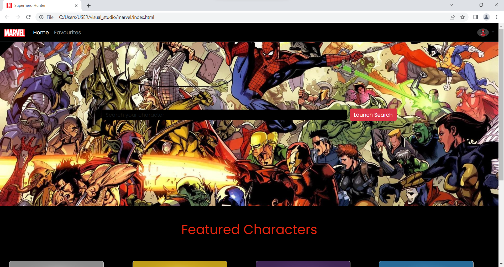
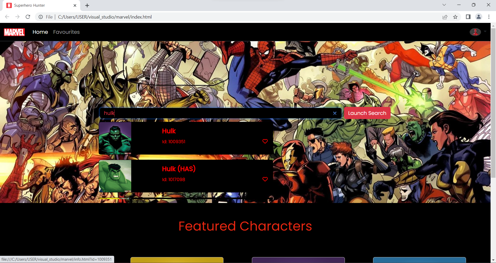
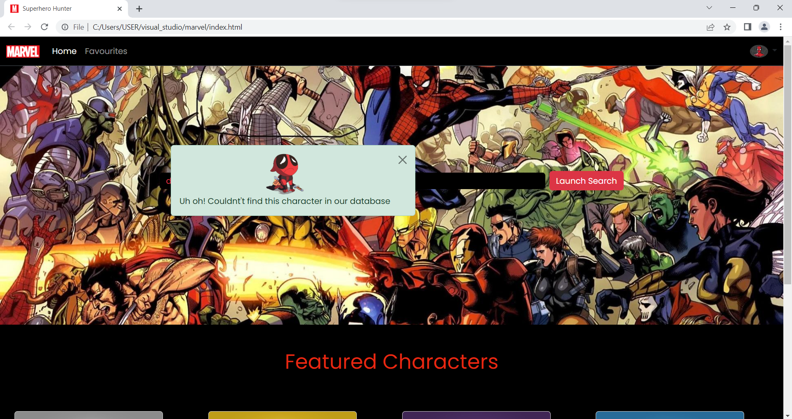
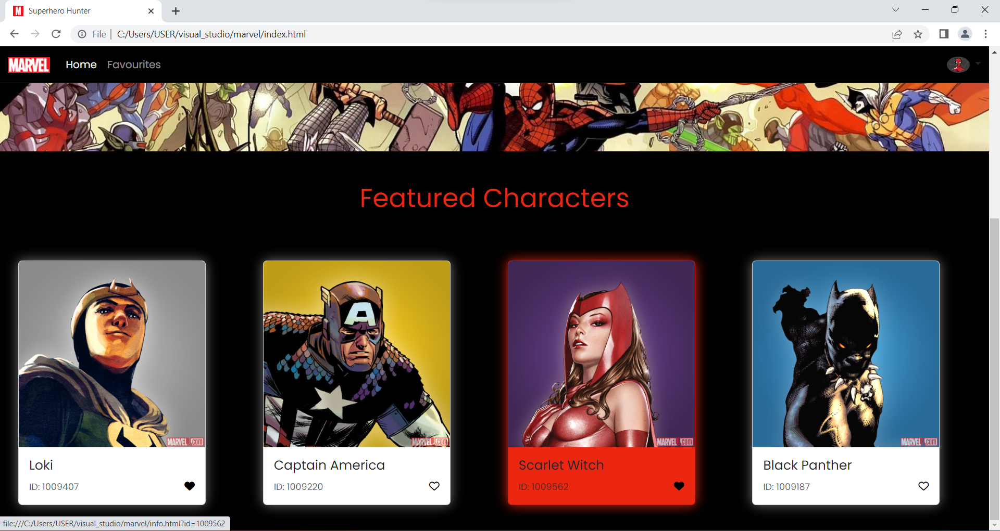
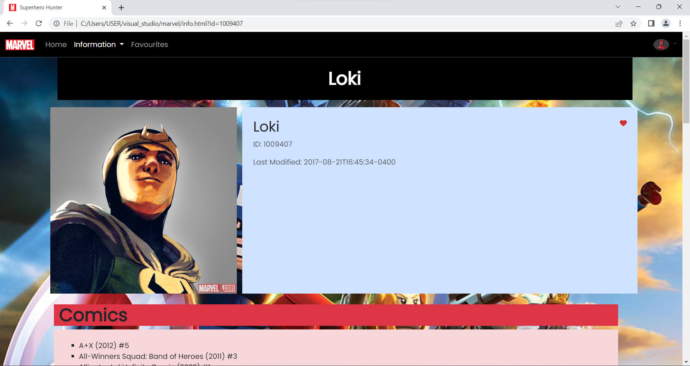
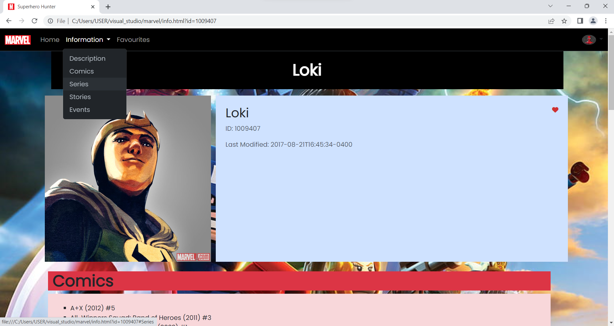
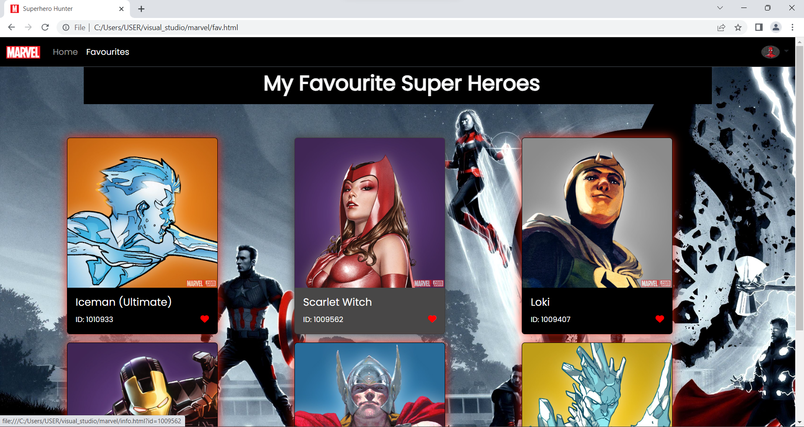

# SuperHero Hunter

Name: Leisha Aloma Dias

Linkedin: www.linkedin.com/in/leisha-dias

Hosted Link: 

## Problem statement
Create a superhero hunter app. Use ONLY vanilla javascript, no libraries or frameworks are allowed for Javascript (you can use any CSS framework like Bootstrap).

## Features

- Home Page
  - Search bar to search any character from the Marvel API.
  - A prompt list of 6 values that were filtered based on the typed text in the search bar.
  - Each result in the prompt list will contain a "add to favourite" option, which when clicked will add the character to list of favourites.
  - On clicking the search button, if a relevant character's name is typed then opens a page with more information regarding that character.
  - Error message is shown for irrelevant names searched.
  - Also clicking any character from the list, opens a new page with more information regarding that character.

- Information Page
  - Shows information regarding the searched character.
  - The details included are name, photo, description, comics, series, stories and events.
  - An "add to favourite" option is present here as well, which when clicked will add the character to list of favourites.

- My favourite superheroes Page
  - Shows all characters that were added to the list of favourites.
  - Reclicking on the button will remove character from favourites. On refresh the changes will be shown.
  - The values of this list is saved and is persistent.
  
## Languages, Frameworks and API used
- This project was made using HTML, CSS and Javscript.
- Additional framework like bootstrap was used as well.
- The website was built using the [Marvel API](https://developer.marvel.com/docs)

### How to use Marvel API
1. Register yourself to the website [Marvel website](https://developer.marvel.com/signup) and generate the public and private key.
2. Follow the instruction on how to use the API key https://developer.marvel.com/documentation/authorization. You need to use the timestamp as ts and then create the hash using md5 hash of ts, private-key and public-key.
3. Make sure to use the right API URL else it will give you a CORS error.

#### How to generate md5 hash? 
```
// first install crypto-js
npm install crypto-js
// now use md5 as below
var MD5 = require("crypto-js/md5"); 
console.log(MD5("text to hash").toString());
```
## What's next?
Linking a profile with an Email address.

## Note
As the loading of data takes time, while typing in the text box please wait for a few seconds.

## Project Demo
#### Home page


#### Search options


#### Search Error


#### Featured Characters


#### Information page


#### Navigation in Information page


#### Favourites page

